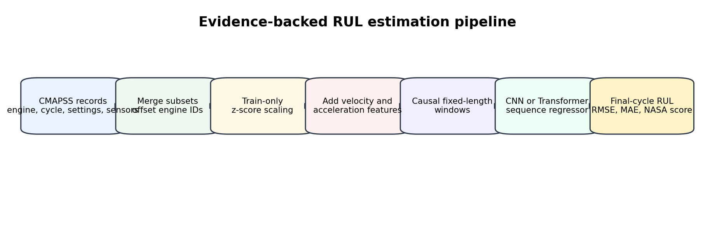
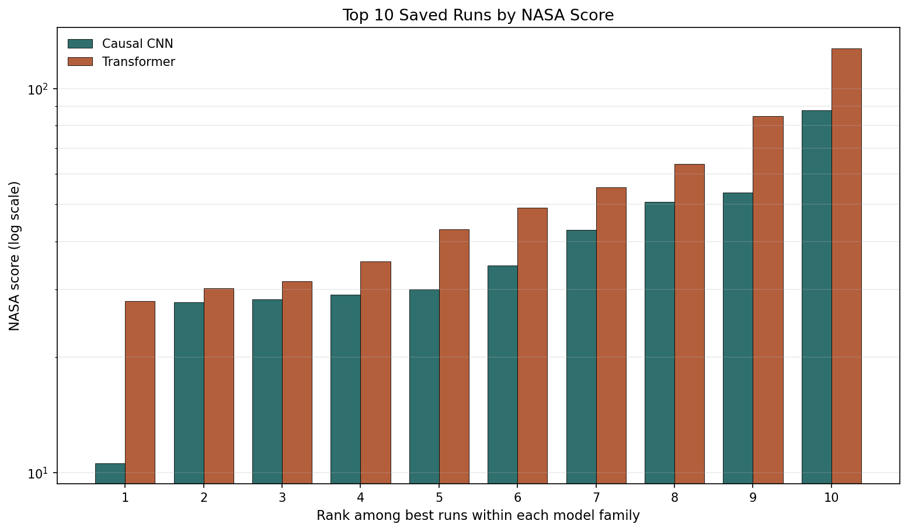

# Causal Deep Learning for Turbofan RUL Estimation

This project estimates the Remaining Useful Life (RUL) of turbofan engines from multivariate sensor trajectories in the NASA CMAPSS dataset. It compares two causal sequence-regression pipelines under the same preprocessing and evaluation protocol:

- a dilated causal convolutional neural network (CNN)
- a causal Transformer with masked self-attention

The key idea is deployment realism: at any cycle, the model can use only current and past sensor readings. The experiments therefore use causal windows, train-set-only normalization, final-window inference, and metrics suited to predictive maintenance.



## Highlights

- Uses all four CMAPSS subsets from `CMaps/`.
- Builds fixed-length temporal windows from engine trajectories.
- Adds first- and second-order derivative features to expose degradation dynamics.
- Trains both model families with a masked, time-weighted regression objective.
- Evaluates using RMSE, MAE, and the NASA asymmetric score.
- Includes 50 saved CNN runs and 50 saved Transformer runs with configs, metrics, checkpoints, and training curves.

## Results

Lower is better for all metrics.

| Model | Best run | Window | Test RMSE | Test MAE | NASA score |
|---|---:|---:|---:|---:|---:|
| Causal CNN | `exp_046` | 1000 | **1.0583** | **0.0741** | **10.6022** |
| Causal Transformer | `exp_016` | 1000 | 1.7273 | 0.1495 | 27.9299 |

Across the recorded search, longer input windows consistently improved performance. The best saved CNN used a compact architecture: window size 1000, stride 2, hidden width 32, two causal convolution layers, kernel size 3, dropout 0.5, and time-weight exponent beta 2.0.



## Dataset

The project uses the NASA Commercial Modular Aero-Propulsion System Simulation (CMAPSS) turbofan degradation dataset. Each row contains:

- engine id
- cycle index
- 3 operating settings
- 21 sensor measurements

Training trajectories run until failure, so per-cycle RUL labels are computed from the final cycle of each training engine. Test trajectories are truncated, and the provided `RUL_FD*.txt` files give the true RUL at the final observed test cycle.

The local dataset is expected under:

```text
CMaps/
  train_FD001.txt
  test_FD001.txt
  RUL_FD001.txt
  ...
  train_FD004.txt
  test_FD004.txt
  RUL_FD004.txt
```

## Method

Both model families share the same high-level pipeline:

1. Load all CMAPSS subsets and offset engine ids to avoid collisions.
2. Split training engines into train and validation groups at the engine level.
3. Fit standardization statistics only on the training engines.
4. Add velocity and acceleration features using first- and second-order temporal differences.
5. Construct fixed-length causal windows.
6. Train with masked, time-weighted MSE.
7. Select the checkpoint with the best validation RMSE.
8. Evaluate each test engine using only its final available window.

The CNN captures temporal structure through dilated causal convolutions. The Transformer uses a causal attention mask so that each timestep can attend only to earlier timesteps in the same window.

## Repository Structure

```text
.
├── CMaps/                         # CMAPSS data files
├── convolution/
│   ├── ml4ps-convolution.ipynb    # Causal CNN pipeline
│   └── all_results.csv
├── transformer/
│   ├── mlps_transformer.ipynb     # Causal Transformer pipeline
│   └── all_results.csv
├── runs_cmapss/                   # Saved CNN experiment artifacts
├── runs_cmapss_Tranformers/       # Saved Transformer experiment artifacts
├── figures/                       # Report and README figures
├── report.tex                     # Full project report
├── references.bib                 # Bibliography
└── README.md
```

Each saved experiment directory contains:

```text
config.json      # sampled hyperparameters
metrics.json     # final metrics and training history
best_model.pt    # checkpoint selected by validation RMSE
history.png      # training/validation curve
```

## Setup

Create an environment with the scientific Python and PyTorch stack:

```bash
python -m venv .venv
source .venv/bin/activate
pip install numpy pandas matplotlib scikit-learn torch tqdm jupyter
```

For CUDA-enabled PyTorch, install the wheel that matches your system from the official PyTorch instructions.

## Running the Notebooks

Start Jupyter from the repository root:

```bash
jupyter notebook
```

Then run either notebook:

- `convolution/ml4ps-convolution.ipynb`
- `transformer/mlps_transformer.ipynb`

The notebooks read data from `CMaps/`, train sampled configurations, and write run artifacts to their corresponding `runs_*` directory.

## Metrics

- **RMSE**: penalizes large prediction errors.
- **MAE**: reports average absolute error.
- **NASA score**: asymmetric prognostics metric that penalizes RUL overestimation more strongly than underestimation, because predicting too much remaining life can delay maintenance.

## Notes and Limitations

The saved experiments support a comparison of the implemented pipelines and hyperparameter sensitivity, not a universal claim that CNNs always outperform Transformers for RUL estimation. All recorded runs use derivative features and time weighting, so isolating those components would require additional controlled ablations.

Future improvements include saving per-engine predictions, reporting per-subset performance, rerunning the best configurations across multiple seeds, and adding ablations for raw-only features, velocity, acceleration, and the time-weighted loss.

## Authors

- Sai Deepak Sana
- Ponguru Bhanu
- Peddineni Harshith

Project for Machine Learning for Physical Sciences, IIT Hyderabad.